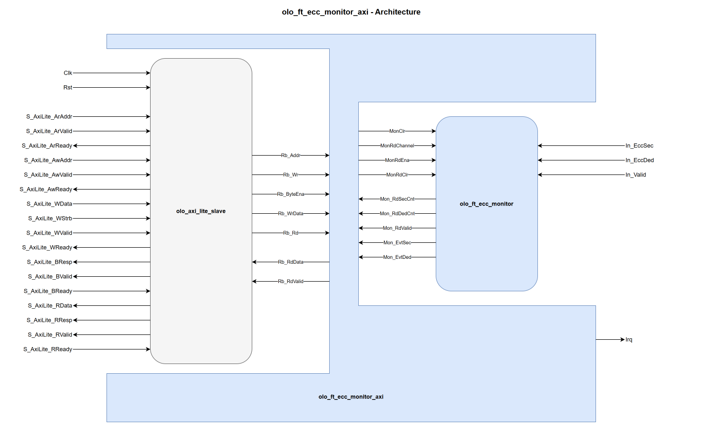

# olo_ft_ecc_monitor_axi

[Back to **Entity List**](../EntityList.md)

## Status Information


VHDL Source: [olo_ft_ecc_monitor_axi](../../src/ft/vhdl/olo_ft_ecc_monitor_axi.vhd)

## Description

This component wraps the [olo_ft_ecc_monitor](./olo_ft_ecc_monitor.md) EDAC monitor with an
**AXI4-Lite register interface** (32-bit data width) and an interrupt output. It is the drop-in
housekeeping block: connect the SEC/DED flags of the ft instances, attach the AXI4-Lite port to the
system bus, and software gets per-channel error counters and event interrupts through the register
map below.

## Generics

| Name              | Type     | Default | Description                                                  |
| :---------------- | :------- | ------- | :----------------------------------------------------------- |
| Channels_g        | positive | -       | Number of monitored channels (range 1 to 255), see [olo_ft_ecc_monitor](./olo_ft_ecc_monitor.md). |
| CounterWidth_g    | positive | 16      | Counter width (range 1 to 16), see [olo_ft_ecc_monitor](./olo_ft_ecc_monitor.md). |
| AxiAddrWidth_g    | positive | 12      | AXI4-Lite address width (range 6 to 30). Must cover the register map; checked by an elaboration assert. |
| ReadTimeoutClks_g | positive | 100     | Read timeout of the wrapped [olo_axi_lite_slave](../axi/olo_axi_lite_slave.md). Reads of unmapped addresses are answered through this timeout with an error response. |

## Interfaces

### Control

| Name | In/Out | Length | Default | Description                                     |
| :--- | :----- | :----- | ------- | :---------------------------------------------- |
| Clk  | in     | 1      | -       | Clock                                           |
| Rst  | in     | 1      | -       | Reset (high-active, synchronous to _Clk_)       |

### AXI4-Lite

The full AXI4-Lite slave interface (`S_AxiLite_*`) with 32-bit data width, identical in behavior to
[olo_axi_lite_slave](../axi/olo_axi_lite_slave.md). Write byte enables are ignored (whole-word
register accesses only).

### Event Inputs

| Name      | In/Out | Length       | Default | Description                                                  |
| :-------- | :----- | :----------- | ------- | :----------------------------------------------------------- |
| In_EccSec | in     | _Channels_g_ | -       | SEC indication per channel.                                  |
| In_EccDed | in     | _Channels_g_ | -       | DED indication per channel.                                  |
| In_Valid  | in     | _Channels_g_ | all '1' | Qualifier per channel, see [olo_ft_ecc_monitor - Connecting Sources](./olo_ft_ecc_monitor.md#connecting-sources). |

### Interrupt

| Name | In/Out | Length | Default | Description                                                  |
| :--- | :----- | :----- | ------- | :----------------------------------------------------------- |
| Irq  | out    | 1      | N/A     | Level interrupt: high while any bit of IRQ_STATUS is set and enabled in IRQ_ENA. Cleared by writing IRQ_STATUS (write-one-to-clear). |

## Register Map

All registers are 32-bit words. The counter block starts at `CNT_BASE = 0x10`.

| Offset          | Name          | Access           | Content                                                      |
| :-------------- | :------------ | :--------------- | :----------------------------------------------------------- |
| 0x00            | INFO          | RO               | [7:0] _Channels_g_, [12:8] _CounterWidth_g_ (software discovery) |
| 0x04            | CTRL          | WO               | Bit 0: CLR_ALL. Writing '1' clears all counters. Reads as zero. |
| 0x08            | IRQ_STATUS    | R / W1C          | Bit 0: SEC event occurred, bit 1: DED event occurred. Write '1' to clear a bit; an event arriving in the same cycle wins over the clear. |
| 0x0C            | IRQ_ENA       | RW               | Bit 0/1: interrupt enable mask for the IRQ_STATUS bits. Reset to zero (masked). |
| CNT_BASE + 4ch  | CNT_ch        | RO / write=clear | [15:0] SEC counter, [31:16] DED counter of channel ch (zero-extended when _CounterWidth_g_ < 16). **Any write clears the channel** atomically; an event arriving in the same cycle survives the clear. |

Reads of unmapped addresses are not acknowledged and are answered by the
[olo_axi_lite_slave](../axi/olo_axi_lite_slave.md) read timeout with an error response. Writes to
read-only or unmapped addresses are ignored (the write response is OKAY).

## Detailed Description

### Architecture



The composition is [olo_axi_lite_slave](../axi/olo_axi_lite_slave.md) (AXI4-Lite protocol handling,
register-bus conversion) plus a small register-decode process plus the
[olo_ft_ecc_monitor](./olo_ft_ecc_monitor.md) core. Counter reads go through the core's read port,
so there is exactly one copy of every counter (no shadow registers); the read response reaches the
AXI master after a few clock cycles, well within the read timeout. The per-channel write-to-clear
reuses the core's atomic read-and-clear mechanism, so the no-lost-events guarantee of the core
carries over to the register interface. The only state the wrapper adds is the interrupt block (two
latch bits, two enable bits) and the response registers; everything remains in flip-flops coverable
by vendor TMR, and like the core, the wrapper has no error-injection ports (no codeword inside).

The core's _DedSticky_ output is not exposed through the register map: per-channel DED visibility
comes from the counter words and the DED interrupt. The port remains available on
[olo_ft_ecc_monitor](./olo_ft_ecc_monitor.md) for direct use in fabric-side safing logic.

### Usage Example

A monitor collecting from a scrub RAM (countable pulses, qualifier left at '1') and a FIFO
(data-aligned flags, qualified with the handshake):

```vhdl
In_EccSec(0) <= Scrub_EccSec;
In_EccDed(0) <= Scrub_EccDed;

In_EccSec(1) <= Fifo_OutEccSec;
In_EccDed(1) <= Fifo_OutEccDed;
In_Valid(1)  <= Fifo_OutValid and Fifo_OutReady;
```

For sources in other clock domains, see
[olo_ft_ecc_monitor - Connecting Sources](./olo_ft_ecc_monitor.md#connecting-sources).

### Further Information

- See
  [Open Logic Fault-Tolerance Principles - Constraints That Apply Across the Area](./olo_ft_principles.md#constraints-that-apply-across-the-area)
  for the constraints that apply across the _ft_ area.
