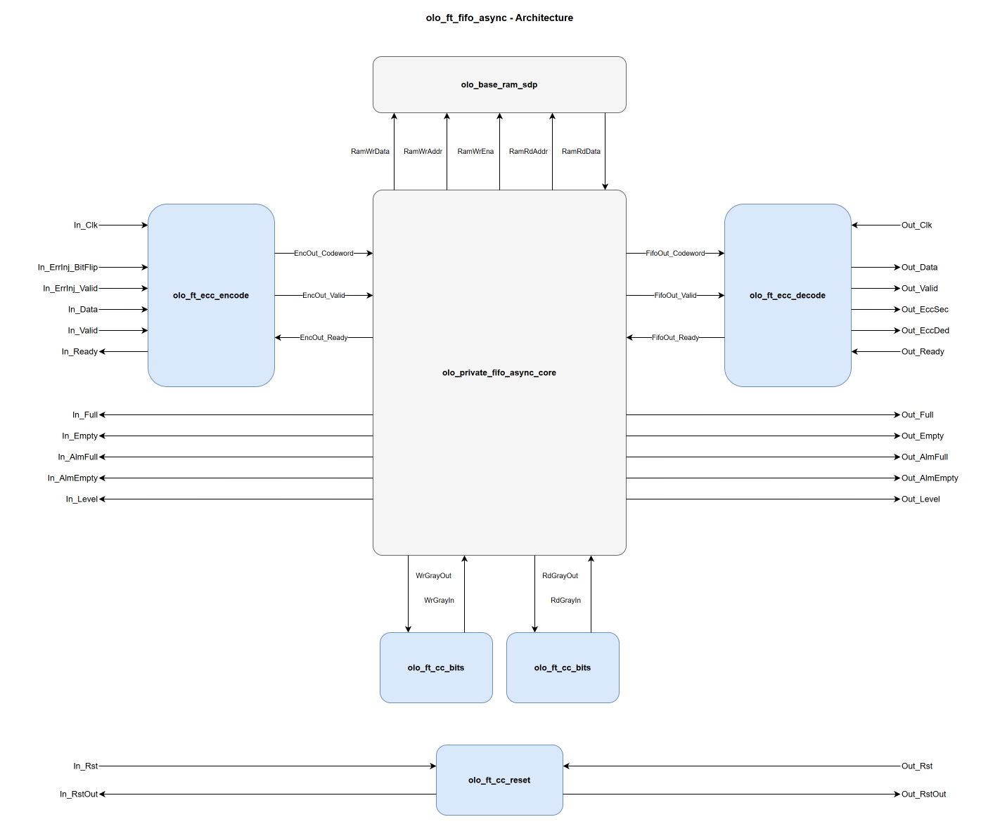

# olo_ft_fifo_async

[Back to **Entity List**](../EntityList.md)

## Status Information

VHDL Source: [olo_ft_fifo_async](../../src/ft/vhdl/olo_ft_fifo_async.vhd)

## Description

This component implements an **ECC-protected asynchronous FIFO** with **TMR-hardened clock domain
crossings**. The data is protected by a SECDED (Single Error Correction, Double Error Detection) Hamming
code and the Gray-pointer and reset crossings are single-SEU immune. The interface and behavior match
[olo_base_fifo_async](../base/olo_base_fifo_async.md).

The ECC is transparent to the user: data is automatically encoded on write and decoded/corrected on read.
Error status flags indicate whether a single-bit error was corrected or a double-bit error was detected.

## Generics

| Name            | Type      | Default  | Description                                                  |
| :-------------- | :-------- | -------- | :----------------------------------------------------------- |
| Width_g         | positive  | -        | Number of data bits per FIFO entry. The internal FIFO is wider to accommodate ECC parity bits. |
| Depth_g         | positive  | -        | Number of entries (must be a power of two)                   |
| AlmFullOn_g     | boolean   | false    | Enable almost-full flag                                      |
| AlmFullLevel_g  | natural   | 0        | Almost-full threshold level                                  |
| AlmEmptyOn_g    | boolean   | false    | Enable almost-empty flag                                     |
| AlmEmptyLevel_g | natural   | 0        | Almost-empty threshold level                                 |
| RamStyle_g      | string    | "auto"   | Controls the RAM implementation resource                     |
| RamBehavior_g   | string    | "RBW"    | Controls the RAM behavior. "RBW" or "WBR"                    |
| ReadyRstState_g | std_logic | '1'      | Value of _In_Ready_ during reset                             |
| Optimization_g  | string    | "SPEED"  | "SPEED" or "LATENCY"                                         |
| SyncStages_g    | positive  | 2        | Number of synchronizer stages per TMR chain in the pointer crossings (range 2..4) |
| EccPipeline_g   | natural   | 0        | Number of pipeline stages on the ECC decode datapath (range 0..2, _Out_Clk_ domain), forwarded to the internal [olo_ft_ecc_decode](./olo_ft_ecc_decode.md) instance. 0 = combinational output. |

## Interfaces

### Input (In_Clk domain)

| Name        | In/Out | Length                  | Default | Description                     |
| :---------- | :----- | :---------------------- | ------- | :------------------------------ |
| In_Clk      | in     | 1                       | -       | Input clock                     |
| In_Rst      | in     | 1                       | -       | Input reset (high-active, synchronous to _In_Clk_). Resets both sides of the FIFO through the internal reset crossing. |
| In_RstOut   | out    | 1                       | N/A     | Synchronized input-side reset output |
| In_Data     | in     | _Width_g_               | -       | Input data                      |
| In_Valid    | in     | 1                       | '1'     | Input valid (AXI-S handshaking) |
| In_Ready    | out    | 1                       | N/A     | Input ready (AXI-S handshaking) |
| In_Full     | out    | 1                       | N/A     | FIFO full (input side)          |
| In_Empty    | out    | 1                       | N/A     | FIFO empty (input side)         |
| In_AlmFull  | out    | 1                       | N/A     | Almost full (input side)        |
| In_AlmEmpty | out    | 1                       | N/A     | Almost empty (input side)       |
| In_Level    | out    | _ceil(log2(Depth_g+1))_ | N/A     | Fill level (input side)         |

### Output (Out_Clk domain)

| Name         | In/Out | Length                  | Default | Description                                                |
| :----------- | :----- | :---------------------- | ------- | :---------------------------------------------------------- |
| Out_Clk      | in     | 1                       | -       | Output clock                                                 |
| Out_Rst      | in     | 1                       | -       | Output reset (high-active, synchronous to _Out_Clk_). Resets both sides of the FIFO through the internal reset crossing. |
| Out_RstOut   | out    | 1                       | N/A     | Synchronized output-side reset output                        |
| Out_Data     | out    | _Width_g_               | N/A     | Output data (corrected if a single-bit error was detected)   |
| Out_Valid    | out    | 1                       | N/A     | Output valid (AXI-S handshaking)                             |
| Out_Ready    | in     | 1                       | '1'     | Output ready (AXI-S handshaking)                             |
| Out_EccSec   | out    | 1                       | N/A     | Single error corrected flag. Time-aligned with _Out_Data_.   |
| Out_EccDed   | out    | 1                       | N/A     | Double error detected flag. Read data is unreliable. Time-aligned with _Out_Data_. |
| Out_Full     | out    | 1                       | N/A     | FIFO full (output side)                                      |
| Out_Empty    | out    | 1                       | N/A     | FIFO empty (output side)                                     |
| Out_AlmFull  | out    | 1                       | N/A     | Almost full (output side)                                    |
| Out_AlmEmpty | out    | 1                       | N/A     | Almost empty (output side)                                   |
| Out_Level    | out    | _ceil(log2(Depth_g+1))_ | N/A     | Fill level (output side)                                     |

### Error Injection (optional, In_Clk domain)

These ports drive the internal [olo_ft_ecc_encode](./olo_ft_ecc_encode.md) instance. Leave them unconnected
for normal operation; see
[Open Logic Fault-Tolerance Principles - Error Injection](./olo_ft_principles.md#error-injection) for the
latched-strobe semantics shared across the _ft_ area.

| Name              | In/Out | Length                                                               | Default | Description                                                  |
| :---------------- | :----- | :------------------------------------------------------------------- | ------- | :----------------------------------------------------------- |
| In_ErrInj_BitFlip | in     | _[eccCodewordWidth](./olo_ft_pkg_ecc.md#ecccodewordwidth)(Width_g)_  | all 0   | Codeword-wide flip pattern. Each '1' bit XORs (flips) the corresponding bit of the stored codeword. Popcount 1 = SEC-correctable, popcount 2 = DED-detectable. |
| In_ErrInj_Valid   | in     | 1                                                                    | '0'     | Strobe that latches _In_ErrInj\_BitFlip_ into the encoder's pending-injection register. The latched pattern is applied to the next accepted input beat. |

## Detailed Description

### Architecture

The entity is a peer of [olo_base_fifo_async](../base/olo_base_fifo_async.md): both instantiate the same
private control core (pointer management, Gray coding, level/flag computation), but the fault-tolerant
variant supplies hardened building blocks around it:

1. [olo_ft_ecc_encode](./olo_ft_ecc_encode.md) (In_Clk domain) encodes each accepted input beat into a
   SECDED codeword.
2. The shared control core plus an [olo_base_ram_sdp](../base/olo_base_ram_sdp.md) instance store the
   codeword. All levels and status flags come from the core.
3. Two [olo_ft_cc_bits](./olo_ft_cc_bits.md) instances cross the Gray-coded write/read pointers between
   the domains, and one [olo_ft_cc_reset](./olo_ft_cc_reset.md) instance crosses the resets. All three are
   TMR-hardened (triplicated synchronizer chains with per-bit majority voters).
4. [olo_ft_ecc_decode](./olo_ft_ecc_decode.md) (Out_Clk domain) decodes and corrects each beat and drives
   _Out_EccSec_ / _Out_EccDed_ time-aligned with _Out_Data_. `EccPipeline_g` inserts register stages on the
   decode datapath.

Because encoding happens before, and decoding after, all storage elements, the codeword is protected
end-to-end through the FIFO, including the core's internal write-data register.

See [olo_base_fifo_async](../base/olo_base_fifo_async.md) for detailed FIFO behavior.

### Clock Domain Crossing in TMR-Based Designs

This section documents the interaction between the asynchronous FIFO's internal clock domain
crossing (CDC) mechanism and Triple Module Redundancy (TMR) environments. It is relevant for
designers using this FIFO in radiation-hardened systems where vendor TMR tools (e.g., Synplify's
`syn_radhardlevel = "tmr"`) are applied to the surrounding logic.

#### What ECC Protects

The ECC (SECDED Hamming code) protects the **data stored in the block RAM**. Data is encoded
before writing and decoded/corrected after reading. This addresses the dominant radiation
vulnerability: block RAM cells are static storage with large cross-sections and long exposure
windows (data persists until the next write, which may be microseconds to mission-lifetime).

#### What the TMR Crossings Protect

The Gray-coded read/write pointers cross clock domains through [olo_ft_cc_bits](./olo_ft_cc_bits.md)
instances: three independent synchronizer chains per crossing with a per-bit majority voter. A single SEU
on any synchronizer flip-flop is masked by the voter. The reset crossing is hardened the same way through
[olo_ft_cc_reset](./olo_ft_cc_reset.md). The manual TMR works regardless of whether vendor TMR is applied
to the rest of the design; the crossing entities carry `syn_radhardlevel = "none"` on their architectures
so vendor TMR tools do not triplicate the already-triplicated registers.

The remaining control flip-flops (binary pointers, flags and the handshake logic inside the control core)
are **not** manually triplicated. They should be covered by vendor TMR
(`syn_radhardlevel = "tmr"`) as part of the surrounding radiation-hardened design, like all other
flip-flops. Unlike RAM cells, these flip-flops are refreshed every clock cycle, so a bit flip persists for
at most one clock period, which makes them orders of magnitude less vulnerable than the static RAM cells.

#### The Sampling Uncertainty + SEU Concern

Li, Nelson, and Wirthlin [1] demonstrated that when TMR is applied to signals crossing
asynchronous clock domains, a combined failure mode can arise: the three TMR copies may arrive
in the receiving domain on different clock cycles due to routing delay differences (signal skew)
and the inherent randomness of asynchronous sampling. This is called **sampling uncertainty**.
If this causes a 2-vs-1 disagreement, a single SEU on one of the agreeing copies can flip the
majority vote, defeating TMR with a single fault.

Their fault injection experiments showed catastrophic failure rates for naively triplicated
**pulse-based** synchronizers: only 47% of signals arrived correctly in the presence of a
sensitive SEU.

#### Why Per-Bit Voting Is Safe for Gray-Coded FIFO Pointers

The Li et al. failure mode applies to **transient pulse signals** where missing one cycle means
losing the information permanently. Gray-coded FIFO pointers are fundamentally different: they
are **persistent multi-bit level signals** with per-bit majority voting. Three properties make
them immune to this failure mode:

**Property 1: Per-bit voting produces only valid pointer values.**

The majority voter operates independently on each bit. At any sampling instant, the Gray code
guarantee ensures that at most **one bit** is transitioning (all other bits are stable and
identical across all three TMR copies). Therefore:

- For any **stable bit**: all three copies agree. A single SEU on one copy is corrected by the
  voter (2-of-3). This works unconditionally.
- For the **one transitioning bit**: sampling uncertainty may cause a 2-vs-1 split. A single SEU
  on the majority side can flip the voted result. But this only affects **one bit**, and that
  bit can only resolve to its old or new value. The result is either the current pointer value or
  the previous pointer value.

Since all other bits are voted correctly, the overall voted pointer is always either `Gray(N)` or
`Gray(N+1)`, **never an invalid value**. An invalid pointer would require **two simultaneous
SEUs**, which is beyond TMR's protection model.

**Property 2: Both possible voted values are safe for the FIFO.**

The async FIFO is designed to operate with +-1 pointer uncertainty; this is the fundamental
design principle of Gray-coded CDC. The synchronized pointer is always a possibly-stale version
of the actual pointer. Whether the voter outputs `Gray(N)` or `Gray(N+1)`:

- If the pointer appears **more stale** (old value): the FIFO flags are more conservative (full
  asserts earlier, empty de-asserts later). No data corruption; at worst, unnecessary
  backpressure for one cycle.
- If the pointer appears **more fresh** (new value): the FIFO flags are less conservative but
  still correct, since the pointer did reach that value.

Neither outcome causes an overflow, underflow, or read of invalid data.

**Property 3: Any voter error self-corrects within one cycle.**

The reflected binary Gray code has a second key property beyond single-bit changes: on two
**consecutive** increments, **never the same bit** changes (the changing-bit pattern follows
the ruler sequence: 0, 1, 0, 2, 0, 1, 0, 3, ...). Once a bit transitions, it holds its new
value for at least **two sender clock periods** before it can possibly change again. This means:

- Cycle N: bit K transitions, sampling uncertainty + SEU causes the voter to output the old value
- Cycle N+1: a **different** bit transitions; bit K is now stable across all three TMR copies
- The voter for bit K now sees three identical inputs: correct output regardless of any SEU

The error is transient and self-heals on the next clock cycle.

#### No Clock Frequency Constraints

The Gray-coded pointer crossing has **no constraints on the clock frequency ratio** between
the write and read clocks. The Gray code single-bit-change property applies at each **individual
sampling instant**, not between consecutive samples. Even if the sender clock is much faster
than the receiver clock and the pointer increments multiple times between receiver clock edges:

- At any receiver clock edge, the pointer is either stable or in the middle of a **single-bit**
  transition (the previous transitions have already settled)
- The receiver may "skip" intermediate pointer values, but each sample captures a valid Gray
  code value (or resolves metastability on one bit to an adjacent valid value)
- The only implicit requirement is that routing skew between pointer bits is less than one sender
  clock period, which is always satisfied in practical designs

#### Summary

| Concern | General TMR CDC [1] | Gray-Coded FIFO Pointers |
|---------|---------------------|--------------------------|
| Signal type | Transient pulse | Persistent level (multi-bit) |
| Voter granularity | Whole signal | Per-bit independent |
| "Wrong" voted value | Information lost | Previous valid pointer (safe) |
| Self-correction | No, the pulse is gone | Yes, within 1 cycle |
| Invalid output possible? | Yes | No, always Gray(N) or Gray(N+-1) |
| Single SEU consequence | MTTF worse than unmitigated | No functional impact |
| Clock ratio constraint | Yes (pulsewidth dependent) | None |

#### Recommendations for Radiation-Hardened Designs

1. **Apply vendor TMR** (`syn_radhardlevel = "tmr"`) to the logic surrounding the FIFO,
   including the FIFO's internal control logic. TMR covers flip-flops, LUT contents, and routing,
   which is everything except the block RAM contents (protected by the ECC) and the pointer/reset
   crossings (protected by their built-in manual TMR).

2. **Consider the FIFO residency time** of your data. The SEU exposure window of a FIFO entry is
   the time between its write and its read. For long-lived buffer contents, use a scrubbed RAM
   ([olo_ft_ram_sdp_scrub](./olo_ft_ram_sdp_scrub.md)) instead of a FIFO, so single-bit errors
   cannot accumulate into uncorrectable double-bit errors.

### ECC Overhead, Error Injection and Status Flags

See the corresponding sections in
[Open Logic Fault-Tolerance Principles](./olo_ft_principles.md):

- [ECC Overhead](./olo_ft_principles.md#ecc-overhead) - internal storage width vs. data width
- [Error Injection](./olo_ft_principles.md#error-injection) - semantics of _In_ErrInj\_BitFlip_ / _In_ErrInj\_Valid_
- [Error Status Flags](./olo_ft_principles.md#error-status-flags) - meaning of _Out_EccSec_ / _Out_EccDed_

### Constraints

See
[Open Logic Fault-Tolerance Principles - Constraints That Apply Across the Area](./olo_ft_principles.md#constraints-that-apply-across-the-area)
for the constraints that apply across the _ft_ area. No additional `olo_ft_fifo_async`-specific constraints
apply.

## References

[1] Y. Li, B. Nelson, and M. Wirthlin, "Synchronization Techniques for Crossing Multiple Clock
Domains in FPGA-Based TMR Circuits," IEEE Transactions on Nuclear Science, vol. 57, no. 6,
pp. 3506-3514, Dec. 2010. DOI: 10.1109/TNS.2010.2086075

[2] Y. Fan and Z. Deng, "Design and verification for CDC synchronization based on TMR," IEICE
Electronics Express, vol. 17, no. 21, pp. 1-6, 2020. DOI: 10.1587/elex.17.20200287
